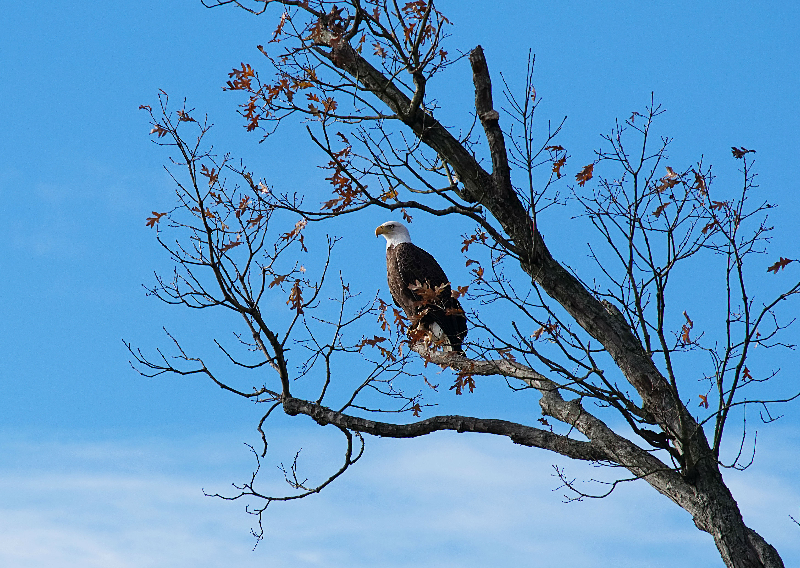

# Correlation

<div class="chapter_image"></div>

```{r setup, include=FALSE}
knitr::opts_chunk$set(echo = TRUE, fig.align = "center", fig.width = 6, fig.height=5, warning=FALSE, message=FALSE)
library( ggplot2 )
theme_set( theme_bw(base_size = 14) )
```

```{r bivar_correlation}

```

