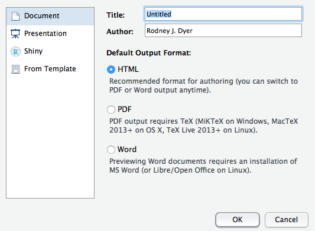
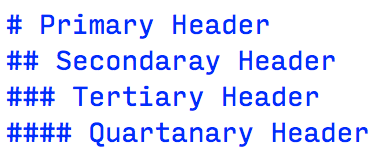
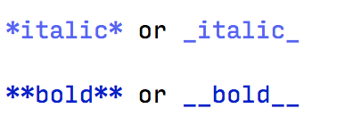
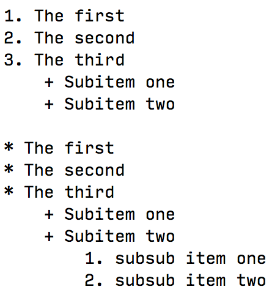
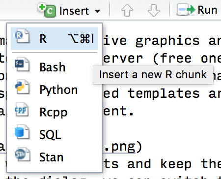
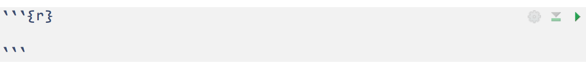
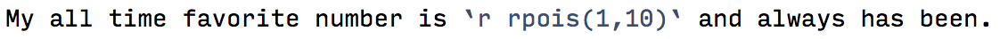

> Writing code and the associated text around the analyses and your data is an odd job that munges together some programming skills, a lot of copy-and-paste, saving images, menu jujitsu (Insert $\to$ Image $\to$ From Computer...), etc.  One of the things that we should strive to do is to minimize the amount of stoooopid work that we have to do in our daily lives, right?  Markdown is a way to create textual output that can be magically turned into many types of output.  In this section, we start looking at some markdown examples that integrate our data, analysis code, and output into a single document that makes our lives suck just a little bit less awesome.

## Markdown

Consider the case where you are making a report using a word processor like Word or Pages.  The most basic part of that document is the actual text that you use in the document.  Certain parts of that text represent different 'landmarks' in the paper, titles and headers are typically of a different typeface, images are saved from a different program, etc.  If you are to include code, results from analyses, images of output and other stuff that isn't directly typed into the document, you must do that outside the word processor and somehow insert it into that document.  This moving between the processor where you are typing the actual content and other external sources of content and mushing them together is pretty much common place.  

In addition to this work flow, at the end of the day you spend a lot of time working on presentation style. Images and tables moving between page breaks, manually renumbering equations and figures, trying to figure out where captions and figure legends go, and at the end of the day, making sure the statistical work that you did stays in sync with how you are presenting the output in the document.  One change in your analysis may percolate to many changes throughout the document that you must manually fix.  Perhaps more importantly though, at the end of the day, you are left with a single Word document.  What if you want to take those analyses and make a presentation, poster, website, docbook, or pdf out of it?  What if you want to make automatic reports on continuous data sources?  You have to do this over and over again manually because you are stuck using a word processor that only makes one kind of output.  Markdown was designed as a way to create content and display it in many different formats, from the same kind of source.  It is a very simple way of creating content that allows you to present it in a wide variety of output formats.  

Markdown is, at a bare minimum, just text.  Anyone can write it using any editor you like.  For our purposes, RStudio is a nice editor and the one we will use.  A markdown file is saved with the extension .Rmd (or .rmd).  To make a markdown document in RStudio, select File $\to$ New File $\to$ RMarkdown...  and you will be give a dialog of potential types of markdown templates to start from that look like the following image.  The main categories on the left are:  

- *Document:* This is the main category of documents you can prepare.  
- *Presentation:* You can make html and pdf presentations using markdown.  
- *Shiny:*  Shiny is a way to make interactive graphics and data 'dashboards' in R that are hosted on a web server (free ones are available or you can host one on your own server if you have one).  
- *Templates:*  This is where specific themed templates are stored for any of the above type of markdown document.   



For the time being, lets stick with documents and keep the default setting for HTML.  As noted in the dialog, we can switch to the other formats later without a problem and HTML output is perhaps the most versatile for using while we are creating the document.


### Marking up Text

In a markdown document, it is all text.  As such, we need to do typographic things like make headings, bold, italics, etc.  Markdown accomplishes these by using symbols around the textual items you are changing.  Here are some examples as an image (if I typed them into this document, which is RMarkdown, they would be converted so you wouldn't see them).

Here are some encoding for differen sized headers.

```{r echo=FALSE}

```

Some ways to provide emphasis via either italics or bold font faces.

```{r echo=FALSE}

```

And several ways that you can create lists (either ordered or unordered) with sublists.  The main point here is that you *must* have at least two spaces at the end of the line *before* the list and at the end of each line for each list item.

```{r echo=FALSE}

```

There are a lot more markup options (footnotes, links, citations, etc.) that can be found by selecting *Help $\to$ Markdown Quick Reference* in RStudio.

### Inserting R Code Chunks

In markdown, code is contained with what is called a 'chunk'.  This chunk can be a block of code (encompassing some kind of data analysis or the creation of some kind of graphical output) or it can be a bit that is inserted inline with your text (e.g., something like *P < 0.0323* may be computed and inserted on the fly).

You can insert a chunk of code by selecting the R option from the Insert menu just above the editor (see below). There is also a keyboard shortcut that can be used to insert a chunk without going to the menu (and it is much faster), though they are platform dependent.

```{r echo=FALSE}

```

Once you insert a chunk, RStudio provides a highlighted section within which you can insert your code.  Everything within the chunk itself is going to be interpreted just as if it were written in a normal R script.  

```{r echo=FALSE}

```

#### Chunk Options

There are several options you can specify that determine the behavior of the chunk.  These are inserted within the curly brackets at the top of the chunk.  Some of the more common ones include:

* `eval=TRUE/FALSE` Determine if the code is actually run.  Perhaps you are just demonstrating the code.
* `echo=TRUE/FALSE` Determine if the code is shown in the output.  We can hide a lot of code 'behind the scenes' in our documents and only provide the output as appropriate (e.g., you'd never show the code for the analysis in your manuscript but it can be embedded in the document directly and serve up the results when you compile it).
* `fig.cap=""` Caption for figures and tables.
* `warning=TRUE/FALSE`, `message=TRUE/FALSE`, `error=TRUE/FALSE` Toggle the visibility of warnings, messages, and errors in the output in the final document.

There are many additional options that can be found in the documentation for knitr (the package that actually does the magic of turning the markdown into something else) at http://yihui.name/knitr/options/

### Variables in Text

Variables and values from the R code in your document can be inserted into the text as well.  To do this, you enclose the R code you are using in between a backslash plus the letter r ("`r") and a trailing backslash ("`").  Here is an image of an example 

```{r echo=FALSE}

```

and the output:

```
My all time favorite number is `r rpois(1,10)` and always has been.
```

Notice how the R code in the backslashes are replaced with normal text and the values executed by the R code as if it was typed inline.  This is how you can interdigitate R results into your textual output.


## Scripting

Thus far, your work has been mostly what is called 'linear programming.'  We have put together a sequence  of commands that could just as easily been done by typing on the command line or putting it into a script.  Above, you learned how to incorporate your results into a docuement format that can be html, docx, pdf, or any host of other formats (your first anlaysis epub is calling!).   For the rest of this section, let's get back to expanding our proficiencey at writing code and focus on code reuse and some other methods for making you more efficient.


## Function Writing

As we have seen, there are often times where you would like to perform some operation more than once.  Instead of a copy-and-paste strategy, we can encapsulate the sequence of steps into a single block of code and assign it a name and alacazam---you have a `function`.  We've been using functions all along, we've just been using ones that some else has designed for us.  When we call `print()` or `ls()` or `read.table()`, these are all functions, which consist of a well-defined name, a pair of matching parentheses (to which you may insert one or more things), and hidden behind the scenes is a set of R code that is performed when you call that function.

A function in R can be defined as:

```{r eval=FALSE}
function_name <- function( arguments ) { Stuff you want the function to do }
```

You define a function name for whatever you like (given you use the names) and assign it the stuff to the right.  In R, the function named `function()` is a special one, it tells R that you are about to create a little routine and you want that set of code to be available to you for later use under the name of whatever you named it.  This allows a tremendous amount of flexibility as you develop your own set of routines and analyses for your work.  The part that actually does stuff is after the function call.  It may be that the function that you create does need some data (those are the arguments) or you may not need any input in to the function (in which you pass no arguments). It all depends upon what you are creating.

The key to understanding functions is that they are encapsulations of code—a shortcut for a sequence of instructions if you will not have to type over and over again.  The less typing you do, the lower the probability that you will have errors (and all code has errors).  

Here is an example of some code that I'm going to develop into a function.  This function will allow me to determine if one genotype could possibly be the offspring of the other genotype.  

```{r message=FALSE, warning=FALSE}
library(gstudio)
loc1 <- locus( c(128,130) )
loc2 <- locus( c(128,128) )
cat( loc1, loc2 )
```


We start out with two loci, a `128:130` heterozygote and a `128:128` homozygote.  These may represent repeat motifs at a microsatellite locus or some other co-dominant genotype.  First, I'll break the locus into a vector of genotypes.

```{r}
off.alleles <- alleles( loc1 )
off.alleles
mom.alleles <- alleles( loc2 )
mom.alleles
```


To be a valid potential offspring there should be at least one of the alleles in the parent that matches the allele in the offspring.  The `intersect()` function returns the set of values common to both vectors.

```{r}
shared <- intersect( off.alleles, mom.alleles )
shared
```


If it has at least one of the alleles present (it could have both if parent and offspring are both the same heterozygote) then you cannot exclude this individual as a potential offspring.  If there are no alleles in common, then the value returned is an empty vector.

```{r}
loc3 <- locus( c(132,132))
dad.alleles <- alleles( loc3 )
intersect( mom.alleles, dad.alleles )
```

This logic can be shoved into a function.  You have to wrap it into a set of curly brackets.  I use the length of the result from the intersect() to return from the function.  Potential values for 

```{r}
potential_offspring <- function( parent, offspring ) {
  off <- alleles( offspring )
  par <- alleles( loc2 )
  shared <- intersect( off, par )
  return( length( shared ) > 0 )
}
```
Now, you can call this function anytime you need, just passing it two genotypes.  If they can be offspring it returns TRUE, as in the comparison between 128:130 and 128:128 genotypes.

```{r}
potential_offspring(loc1, loc2)
```

And it returns FALSE for the comparison between 128:128 and 132:132.

```{r}
potential_offspring(loc2, loc3)
```

### Variable Scope

There is a lot more information on writing functions and we will get into that as we progress through the text.  However, it is important that I bring this up now.  The value assigned to a variable is defined by its scope.  Consider the following code
```{r}
x <- 10
```

and the function defined as 

```{r}
do_it <- function( x ) {
  x <- x + 10
  return( x )
}
```

When I call the function, the variable x that is the argument of the function is not the same variable that is in the environment that I assigned a value of 10.  The x in the function argument is what we call “local to that function" in that within the curly brackets that follow (and any number of curly brackets nested within those, the value of x is given whatever was passed to the function.

## Decision Making

We interact with our data in many ways and introspection of the values we have in the variables we are working with are of prime importance.  Decision making in your code is where you evaluate your data and make a choice of outcomes based upon some criteria.  Here is some example data that we can use as we explore the basics of `if()`, `if(){} else{}`, and `if(){} elif(){} else{}` coding patterns.

### The if Pattern  

The most basic version of decision making is asking a single question and if the answer is TRUE then do something.  The `if(){}` function does this and has the form

```{r eval=FALSE}
if( CRITERIA ) {
	DO_SOMETHING
}
```

You pass a logical statement (or something that can be coerced into a logical type) to the function as the CRITERIA and if it evaluates to `TRUE`, then the contents of the `DO_SOMETHING` are executed.  If the value of `CRITERIA` is not `TRUE` the `DO_SOMETHING` is skipped entirely—it is not even seen by the interpreter.  

Here we can test this out using the loci defined above along with the is_heterozygote() function.  This function takes one or more locus objects and returns TRUE/FALSE if they are or are not a heterozygote.

```{r}
is_heterozygote( c(loc1, loc2) )
```

If we shove that function into the `if()` parameters we can use its evaluation of the heterozygous state of the locus to do something interesting, say tell us it is a heterozygote—it is admittedly a contrived example, but hey you try to make easy examples, it is not easy.

```{r}
if( is_heterozygote(loc1) ){
  print("It's a het!")
}
```

If the `is_heterozygote()` function returns a value of FALSE, then the contents of the `if()` function (the stuff within the curly brackets is skipped entirely.

```{r}
if( is_heterozygote(loc2) ){
  print("It's a het!")
}
```

Notice, there was no indication of any of that code inside the curly brackets.
The if-else Pattern
If there are more than on thing you want to potentially do when making a decision, you can add an else clause after the if pattern.  Here if is_heterozygote() returns FALSE, the contents of the else{} clause will be executed.  Here is the heterozygote example

```{r}
if( is_heterozygote(loc1) ) {
  cat(loc1, "is a heterozygote")
} else {
  cat(loc1, "is a homozygote")
}
```

and the homozygote one

```{r}
if( is_heterozygote(loc2) ) {
  cat(loc2, "is a heterozygote")
} else {
  cat(loc2, "is a homozygote")
}
```

There is a slightly shorter version of this that is available for the lazy programmer and lets be honest, all programmers are lazy and the more you can accomplish with fewer strokes on the keyboard the better (this is how we got emacs and vim).  I generally don't teach the shortcuts up front, but this one is short and readily apparent so it may be more helpful than confusing.  The `ifelse()` function has three parts, the condition, the result if `TRUE`, and the result if `FALSE`.

```{r}
ans <- ifelse( is_heterozygote( c(loc1, loc2)) , "heterozygote", "Not")
ans
```

So iterating through the x vector, the condition `x>0` is evaluated and if TRUE the sqrt() of the value is returned, else the NA is given. It is compact and easy to use so you may run into it often.

### The `if-else` Pattern

It is possible to test many conditions in a single sequence by stringing together else-if conditions.  The point that is important here is that the first condition that evaluates to TRUE will be executed and all remaining ones will be skipped, even if they also are logically TRUE.  This means that it is important to figure out the proper order of asking your conditions.  Here is an example function that determines if none, one, or both of the genotypes passed to it are heterozygotes.  By default, I step through every one of the potential options of available on this comparison.    
1. The first is a heterozygote and the second one isn't
2. The first one isn't and the second one is
3. Both are heterozygotes
4. The last state (both are not) 

Here is the function.

```{r}
which_is_het <- function( A, B) {
  if( is_heterozygote(A) & !is_heterozygote(B) ) {
    print("First is heterozygote")
  } else if( !is_heterozygote(A) & is_heterozygote(B) ){
    print("Second is heterozygote")
  } else if( is_heterozygote(A) & is_heterozygote(B) ){
    print("Both are heterozygotes")
  } else {
    print( "Neither are heterozygotes")
  }
}
```

It is possible that the order of these CRITERIA could be changed, the important thing to remember is that the sequence of if - else if - else if etc. will terminate the very first time one of the CRITERIA is evaluated to be `TRUE`.

## Flow Control

Flow control is the process of iterating across objects and perhaps doing operations on those objects.  The R language has several mechanisms that you can use to control the flow of a script or bit of code.  

### The `for()` Loop

```{r}
x <- c(3,8,5,4,6)
x
```

You can iterate through this vector using a for() loop.  This is a simple function that has the form:

```{r eval=FALSE}
for( SOME_SEQUENCE ){
  DO_SOMETHING
}
```


Where the `SOME_SEQUENCE` component is a sequence of values either specified OR calculated and the `DO_SOMETHING` is the thing you want to do with each of the values in the sequence.  Usually, there is a variable defined in the `SOME_SEQUENCE` component and the value of that variable is used.  Here are a few examples. The first goes through the existing vector directly and assigns (in sequential order) the entries of ‘x' to the variable val. We can then do whatever we want with the value in val (though if we change it, nothing happens to the original x vector).

```{r}
for( val in x ){
  print(val)
}
```

We can also specify a sequence directly and then use it as an index.  Here I use an index variable named i to take on the integer seqeunce equal in length to the length of the original `x` variable.  Then I can iterate through the original vector and use that index variable to grab the value I want.

```{r}
for( i in 1:length(x)){
  print( x[i] )
}
```


Both give us the same output, namely a way to go through the variable `x`. However, there may be a need to use the latter approach in your calculations.  For example, perhaps I want to do some other operation on the values.  In this very contrived example that follows, I want to perform operations on the values in `x` depending on if they are even or odd.  For the odd ones, I add the corresponding value in `y` and if not I subtract it.  Sure, this is totally contrived and I cannot think of a reason why I would be doing this, but if I need to know what index (row, column or whatever) an entry is during the iteration process, then I need to use this approach over the `for( val in x)` approach.

```{r}
y <- 1:5
for( i in 1:length(x)){
  if( x[i] %% 2)
    print( x[i] + y[i])
  else
    print( x[i] - y[i] )
}
```

### Short Circuiting the Loop

It is possible to short circuit the looping process using the keywords next and break, though in my programming style, I consider their use in my source files as evidence of inelegant code.  That said, you may need them on occasion.  

The next keyword basically stops all commands after that during the current iteration of the loop.  It does not terminate the loop itself, it just stops the commands that follow it this time through.  Here is an example that uses the modulus operator, `%%` (e.g., the remainder after division), to print out only those numbers that are divisible by three.

```{r}
for( i in 1:20 ){
  if( i %% 3 )
    next
  cat("The value of i =",i,"\n")
}
```

The use of break to exit the loop entirely is perhaps more commonly encountered.  When this keyword is encountered, the loop terminates immediately, as if it reached the send of the sequence.  

```{r}
for( i in 1:10){
  if( i > 2 )
    break
  cat("The value of i=",i,"\n")
}
```


