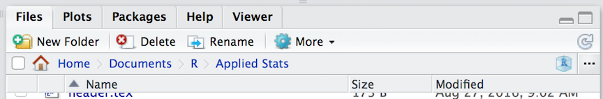
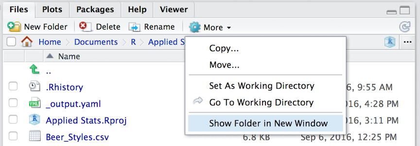
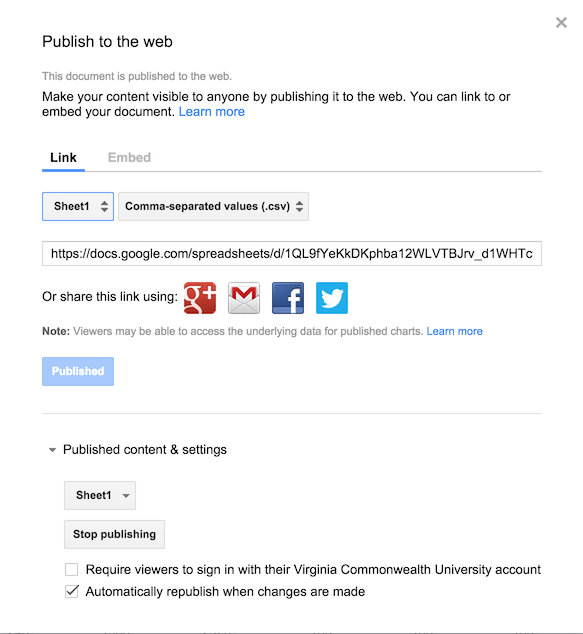

```{r setup, include=FALSE}
knitr::opts_chunk$set(echo = TRUE, fig.align = "center", fig.width = 6, fig.height=5, warning=FALSE, message=FALSE)
library( ggplot2 )
theme_set( theme_bw(base_size = 14) )
```


## Data Import & Export

Raw data is imported into R using `read.*` functions.  There are a wide variety of file formats available, most of which have a corresponding function (e.g., `read.csv()`, `read.delim()`, `read.dcf()`, etc.).  For our purposes, we will focus on using *comma separated* files (*.CSV) as they are the most readily available and can be read by almost all editors and spreadsheet functions.   

On the lecture webpage, there is a file named `iris.csv`.  Download this file and put it in the same directory as your RStudio session.  If you do not know where this is, you can find it by asking R to get its current working directory as: 

```{r}
getwd()
```

The same information is also printed across the top of the "Files" pane in the RStudio interface (though it starts from your 'home' directory instead of the top of the file path).

```{r echo=FALSE, dpi=144}

```

One way to easily open this location is to select the "Show Folder in New Window" menu item in the "More" menu on that same pane.  It will open the folder you are looking at in the file system as a new window for you, then you can drag and drop things into it.

```{r echo=FALSE, dpi=144}

```

Keep in mind that R is running in a specific location on your computer.  This working directory is where it looks for stuff if you do not give a complete file path (e.g., 'C:\\Users\...' or '/Users/...' on winblows and mac, respectively).  

### Reading Structured Data

Structured data may come in many forms, perhaps the most common of which is comma-separated (or CSV) data.  In this kind of file, each row represents an object and each column represents one or more observations made on that object.  This is pretty much what a spreadsheet is and is the basis of most data we will be working with.  

To load in a CSV file, we can use the function:

```{r eval=FALSE}
data <- read.csv("file.csv")
```

where at a bare minimum, we need to have the name of the file (in the example above it was 'file.csv').  

This function is focused on comma-delimited files and is a special case of a more general function `read.table()` which loads in many different kinds of data from files. There are a lot of additional arguments you can pass to `read.csv()` including:  

- `header = TRUE`: Does the file have a header row that gives the variable names?  
- `sep = ","`:   What is the column separator.  By default for CSV, it is a comma.  
- `quote = "\""`:  Is there text that is quoted within the body of the document?  
- `dec = "."`: What is the decimal character?  
- `fill = TRUE`: Do you want to fill in the empty data cells or do all rows of data have the same amount of data.  
- `comment.char = ""`:  Are there comments in the text?  
- `na.strings = "NA"`: What is the default encoding for missing data in the data file (in the olden days a value like `-9` was common for some reason).  
- `stringsAsFactors = TRUE`: This is a global option that will automatically set any character data column to be equal to a Factor type. I'm generally not that much of a fan of this option.  You can set the default behavior for this globally to `FALSE` (and many other global options and function you want to be set every time you start up R) by adding the line `options(stringsAsFactors=FALSE)` to your `.Rprofile` file (see the help file associated with `.Rprofile` for more information on where this is located on your machine).  

Additional options are available if you look at the help file as:

```{r eval=FALSE}
?read.table
```

Once you have read the file in (it will complain with an error message if it does not work), then you will have a `data.frame` object named `data` (from the example above, you should of course name it something more descriptive).

### Reading Textual Data

Not all the data you read in will be in a spreadsheet format.  <!-- TODO: Add text data -->


### Saving Data

Saving materials in R is a bit easier.  If you are needing to export the file back into a CSV format then you can use `write.csv()` (see `?write.csv` for specifics and examples) and it will write the file as a text file.  However, if you are only working in R with that file, you can save it as an R object without translating it back and forth through a CSV file.  Using the example data from above, you could save the `data.frame` as an R data object using:

```{r eval=FALSE}
save( data, file="mydata.rda")
```

and it will save the object.  Next time you need it, you can load it in using:

```{r eval=FALSE}
load("mydata.rda")
```

### Exporting Fromatted Data

While you work in `R` it is probably easiest to keep you data in `*.rda` files so you don't have to import them all the time.  However, there are times when you must export your data into a text format for other programs or users to access.  

It may not be that surprising that there is a function `write.table()` that allows you specify the parameters for 

```{r eval=FALSE}
?write.table
```


### Exporting Textual Data

More here <!-- TODO: More here -->


## Online Data

As a scientist, the integrity of your data is your #1 priority.  In fact, I argue that your ability to write advertisements of your research, which is what manuscripts really are, is secondary to the data that you collect and provide the community.  As a practitioner, you get more credit and are providing more to your research community if your data are not only collected with integrity but able to be used by others.  In the near future, the DOI for your data sets will be as important as the ones for your manuscripts.

For your data to have the most impact, it needs to be both available and valid.  One way to help keep your data intact is to put it in one place and only pull from there to do analyses when you need to do them.  You should <b>ALWAYS</b> keep your data and your analyses as close to each other as possible.  Once they get separated, things go crazy.  For example, consider the case where you send your colleague a copy of your data in a spreadsheet.  Now you have two potentially different (and divergent) representations of your data.  Any change that either you or your colleage make to the data is not mirrored.  Which one is correct?  What happens when you put a copy on the laboratory computer and do some analyses with it, then copy it to your 'backup drive' (or even worse a thumb drive) and then put a copy of it on your laptop.  Then when you get home, a copy goes on your home computer.  How many different copies of your data are there in the world?  Which one is correct?  Somewhere down the road, you will need to recreate a figure for a manuscript, give someone a copy of your data, reanalyze your raw data with a new approach that you run across, etc.  Which copy of the data that you haven't worked on for the last 6+ months is the right one?  Which one is valid?  Even if you use an awesome naming scheme like "Data.last.version.xls", "Data.really.last.version.xls", "I.totally.mean.last.version.xls" etc..  Not going to serve you well in the long run.  All of this is terrifying from the perspective of reproducibility.

One way to keep data available with integrity is to have it located in one, and only one, location.  If you use Google Drive, this is a pretty easy thing to do.  You can keep your spreadsheet online, and then just access the data for your anlayses when you need to.

### Publishing Spreadsheets from Google Drive

Here is how you set that up.  Upload your data into a Google Spreadsheet and then select `File` &rightarrow; `Publish to the Web...`

You will be given a box like this



on which you can start making the data available.  For our purposes, we will want to:
* Publish just one sheet  
* Publish it as a CSV file   
* Grab the URL associated with the published file.

These URL's are tremendously long, I often use [tinyURL](http://tinyurl.com) to shorten it.  Here is how I would grab it from the web in an R script.

1. Load in the `RCurl` library and then grab the contents of the URL we are looking at.
```{r, message=FALSE}
require(RCurl)
link <- "https://docs.google.com/spreadsheets/d/1Mk1YGH9LqjF7drJE-td1G_JkdADOU0eMlrP01WFBT8s/pub?gid=0&single=true&output=csv"
url <- getURL( link )
```   

2. Initiate a `textConnection()` with the URL.  This will act just the file name we typically use when reading in data from the local
```{r}
con <- textConnection( url )
```

3. Read the text in using the normal methods we use for reading in data files.  In this case, it is a spreadsheet with microsatellite genotypes for *Cornus florida*.
```{r,message=FALSE}
data <- read.csv(con)
```

This reads in the data file and we can now work on it.

```{r}
summary(data)
```

If you need to make any changes to the data itself, do so on the Google Drive version.  This way that all modifications are made on one, and only one, set of data.  When you need to run your analyses again, you will now always be pointing to the correct dataset.  This is a start.

