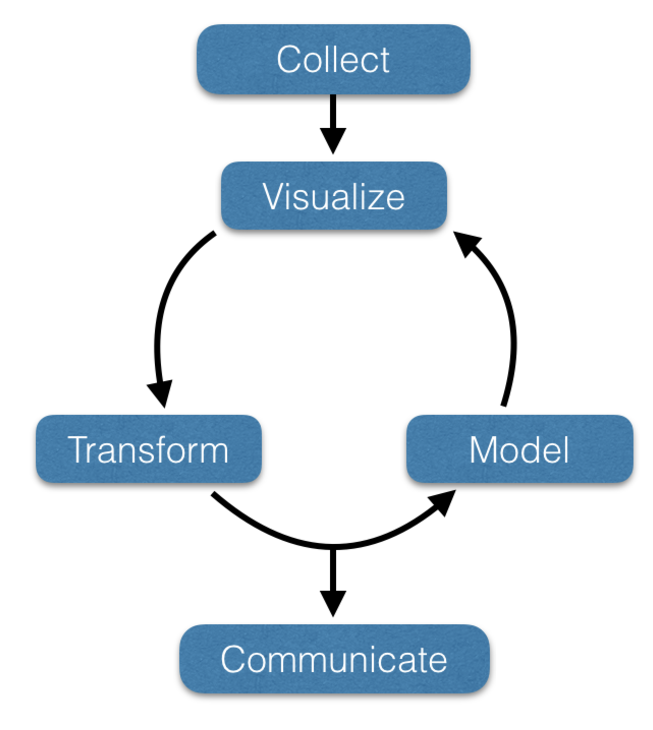

```{r setup, include=FALSE}
knitr::opts_chunk$set(echo = TRUE)
```

> Moreover, the dynamic integration of data generated through observation and simulation is enabling the development of new scientific methods that adapt intelligently to evolving conditions to reveal new understanding.  The enormous growth in the availability and utility of scientific data is increasing scholarly research productivity, accelerating the transformation of research outcomes into products and services, and enhancing the effectiveness of learning across the spectrum of human endeavor.  [National Science Foundation](http://www.nsf.gov/pubs/2007/nsf0728/)

Being able to attain, work with, visualize, manipulate, and analyze data is an absolutely necessary set of skills for all environmental and biological scientists.  This course is designed to help you gain foundational skills and strategies necessary for you to grow as a data scientist.  This course will include:  
- Fundamentals of data acquisition,  
- Approaches for visualizing data,   
- QA/QC and data modifications,  
- Applying specific models to data,  
- Developing methods for Communicating about your data and findings  

## Life Cycle of Data Analyses

The process of data analysis has a relativley predictable life-cycle, as depicted below.  Our ability to gain biologically or environmenally relevant inferences from the data we collect depends upon the inner loop wherein visualization, transformation, and modeling feed back in an iterative chain of increased understanding.

```{r fig.cap="A graphical representation of the life cycle of data science.  In this course the recursive inner loop will be emphasized such that you gain skills of iterative data analysis and inferences.", echo=FALSE}

```


## Course Logistics

During this semester, you will be primarily working on data.  This requires us to jump directly into the kinds of tools that you will need to be proficient with, the mechanisms by which you can attain biologically relevant data, and an skills to apply those tools.  We will be primarily working in R, an open-source set of software that forms the backbone of modern analytical approaches.

### Syllabus

The syllabus covers the logistics of the course.  You must read and in the space below agree to the conditions of the syllabus before we start this course.

<iframe src="https://docs.google.com/document/d/19a-jliGboUPsGKMJnGuCtBTnqhwKRdP_dTlqF8-a298/pub?embedded=true"  frameborder="1" width="600" height="389" allowfullscreen="true" mozallowfullscreen="true" webkitallowfullscreen="true"></iframe>

### Schedule of Topics

Here is the course calendar.  

<iframe src="https://docs.google.com/spreadsheets/d/1ZxR-J_kcQKo5Kn0zf1UBZxH9aZfZVFPfk81ba_VNrPc/pubhtml?gid=0&amp;single=true&amp;widget=true&amp;headers=false"  frameborder="1" width="600" height="389" ></iframe>


### Contact Information

When I am on campus, my door is always open.  If you have any questions or want to chat about content in this course, feel free to pop in and see me.  
- Email: rjdyer@vcu.edu  
- Web: http://dyerlab.org  
- Twitter: https://twitter.com/Dyerlab   
- Hours: Continuous, appointments available.  
- Location: [Trani Life Sciences Building Suite 105](https://drive.google.com/open?id=1TgBrg9QqXDa1fCXY0zSbVc8yYJA&usp=sharing)
